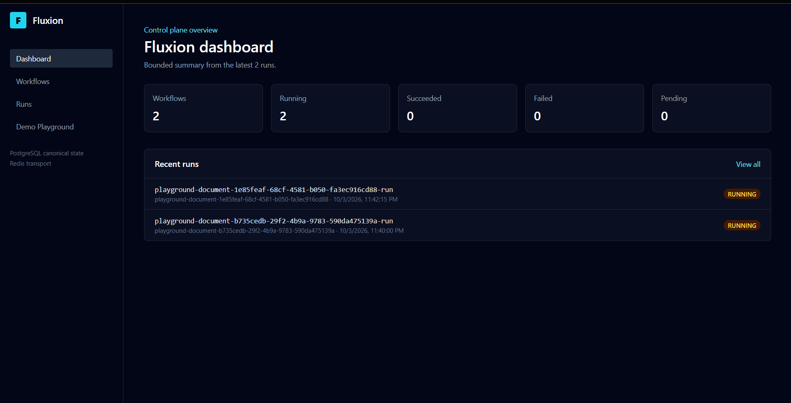
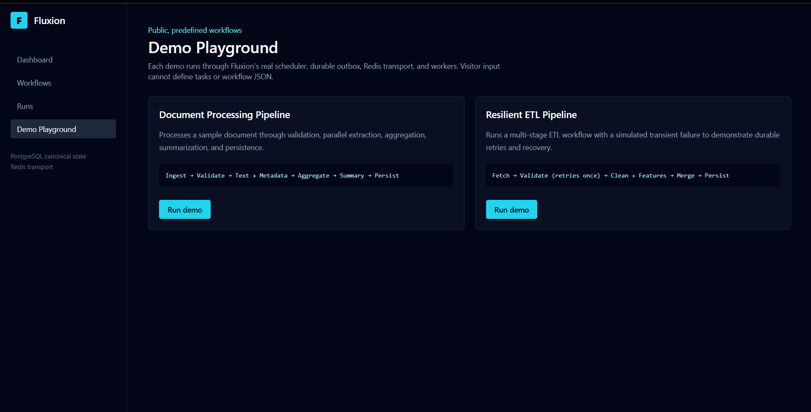
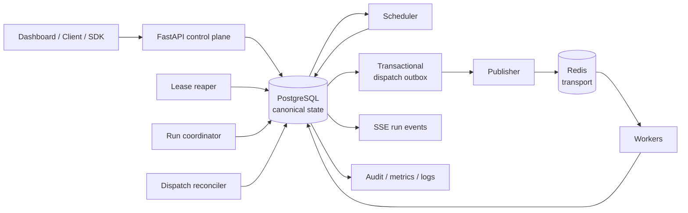
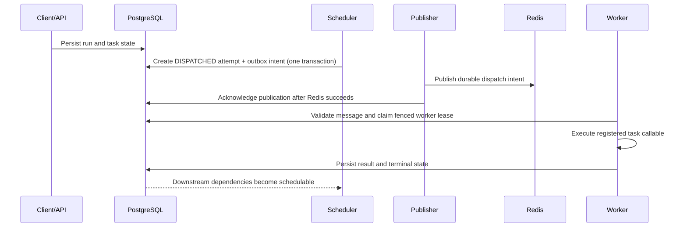
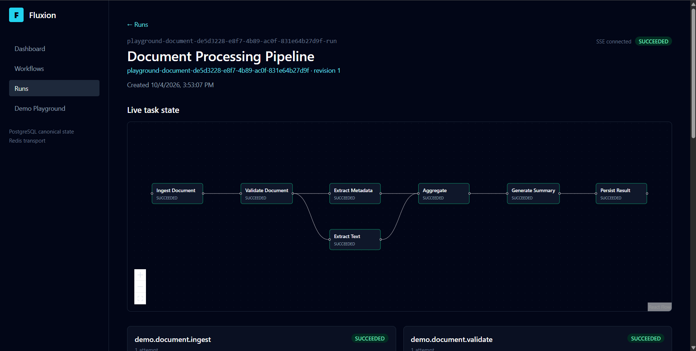

# Fluxion

[](https://github.com/ayushxt25/fluxion/actions/workflows/ci.yml)
[](https://www.python.org/)
[](https://github.com/ayushxt25/fluxion/tree/v1.0.0)

> A PostgreSQL-backed distributed DAG workflow execution engine with durable
> state, transactional dispatch, worker coordination, and at-least-once
> execution semantics.

Fluxion separates canonical execution state from delivery transport: PostgreSQL
stores workflow state, attempts, results, leases, and outbox intent; Redis
carries dispatch messages to independently deployable workers. It is a
system designed around the correctness boundaries that matter when work can be
retried, duplicated, interrupted, or recovered.

**Explore:**
[architecture](docs/ARCHITECTURE.md) ·
[benchmarks](docs/BENCHMARK_RESULTS.md) ·
[deployment](docs/DEPLOYMENT.md) ·
[release notes](docs/RELEASE_1_0.md) ·
[documentation index](docs/README.md)



_The live dashboard is a read-only control-plane view over durable workflow
state; counts and recent runs come from the deployed service, not mock data._

## Why Fluxion

- **Durable execution path:** workflow and task state live in PostgreSQL; a
  transactional outbox closes the database-to-broker dispatch gap.
- **Explicit delivery semantics:** Redis is transport only. Delivery and
  execution are at least once, so duplicate handling is a deliberate design
  concern rather than an implicit promise.
- **Safe ownership recovery:** worker and coordinator leases use fencing to
  reject stale owners. Ambiguous work is held for an explicit operator decision.
- **Reproducible workflow definitions:** runs are pinned to immutable workflow
  revisions and task parameter mappings are validated before execution.
- **Operational depth:** retries, reconciliation, cancellation, retention,
  RBAC/audit, SSE events, preflight checks, chaos tests, and benchmarks are all
  part of the repository—not mocked around the core path.

## Live demo

[](https://fluxion-m5h1l4q1e-valerian1.vercel.app/)
[](https://fluxion-c153.onrender.com)

The public portfolio deployment runs a Next.js dashboard on Vercel, a Render
Free backend, managed PostgreSQL, and Redis. To fit free-tier limits, the
public-demo container co-locates the API, scheduler, publisher, worker, and
reaper. **That is a hosting constraint, not Fluxion's normal topology:** these
runtimes are designed to be deployed independently.

The Demo Playground can start only two server-defined, side-effect-free
workflows; it does not accept arbitrary workflow JSON or user code:

| Workflow | What it demonstrates |
| --- | --- |
| Document Processing Pipeline | Validation, parallel text/metadata extraction, fan-in aggregation, summary generation, and clearly labelled demo persistence. |
| Resilient ETL Pipeline | Parallel cleaning/feature computation and a deliberately simulated transient validation failure that succeeds on Fluxion's durable second attempt. |



The Playground's server route accepts only these predefined identifiers. It
does not accept arbitrary workflow definitions, task code, or browser-exposed
control-plane credentials.

## Architecture



PostgreSQL is the source of truth. Redis delivery is intentionally replaceable
and at least once; workers validate every message against durable state before
claiming an attempt. See the [full architecture](docs/ARCHITECTURE.md) for
recovery, coordination, schedules, triggers, webhooks, and retention.

## How a task moves through Fluxion



The outbox protects the PostgreSQL-to-Redis handoff, not external side effects.
If a worker loses ownership after a task may have run, Fluxion records an
`INTERRUPTED` attempt and waits for an administrator to choose `RETRY` or
`FAIL`; it never auto-retries that ambiguity.

## Performance

**Verified local end-to-end benchmark — not a hosted-production capacity
claim.** The following single-task workload ran on Windows with Python 3.11.9,
16 workers, and one worker loop per worker. It exercised workflow submission
through durable completion, including scheduler, outbox, Redis, workers, and
PostgreSQL correctness checks.

| Metric | Result |
| --- | ---: |
| Runs / task executions | 100,000 / 100,000 |
| Successful / failed / interrupted / cancelled | 100,000 / 0 / 0 / 0 |
| Submission duration | 739.993 s |
| Execution duration | 4,341.131 s |
| Submission-to-completion duration | 5,081.124 s |
| Execution throughput | 23.035 tasks/s |
| Submission-to-completion throughput | 19.681 tasks/s |
| End-to-end latency (p50 / p95 / p99) | 2.338 s / 5.474 s / 5.990 s |
| Maximum Redis queue depth | 82 |
| Correctness validation | PASS |

Benchmark commit: [`bb9cee9`](https://github.com/ayushxt25/fluxion/commit/bb9cee9f4b29d698f0dc9f76e5e5273fe6ec628a).
The scheduler was the dominant bottleneck in this environment. The publisher's
active-time publication rate was about 326 tasks/s, which is a component
measurement rather than end-to-end system throughput. Reproduce or compare
results with the [benchmark methodology and captured runs](docs/BENCHMARK_RESULTS.md).

## Reliability and correctness

Fluxion favors explicit, durable state transitions over optimistic claims:

- PostgreSQL is canonical; Redis is task transport only.
- Dispatch and execution are **at least once**, never claimed as exactly once.
- Task idempotency keys remain stable across retries; attempt identities change.
- Worker and coordinator fencing prevent stale owners from committing state.
- Reconciliation repairs eligible lost dispatches without creating a new attempt.
- Pending ambiguity interventions protect execution evidence from retention.
- Correctness validation is part of the benchmark result; a violated invariant
  makes the benchmark invalid rather than merely slower.

## Core capabilities

- Durable DAG runs, task attempts/results, workflow input mappings, and
  immutable workflow revisions
- Scheduler, transactional outbox, publisher, Redis workers, retry/backoff,
  cancellation, reconciliation, and distributed coordination
- Worker leases/fencing plus conservative interrupted-work intervention
- Schedules, event triggers, signed webhooks, retention, and SSE run events
- FastAPI control plane, typed sync/async SDK, JWT/RBAC, rate limiting, audit,
  structured logs, Prometheus-compatible metrics, and startup preflight

## Detailed reference

The sections below are the operational reference. For focused reading, start
with [architecture](docs/ARCHITECTURE.md), [deployment](docs/DEPLOYMENT.md),
[benchmark results](docs/BENCHMARK_RESULTS.md), and the [release notes](docs/RELEASE_1_0.md).

## Python SDK

Fluxion ships a handwritten public Python SDK that uses only the REST API. It
does not expose database sessions, repositories, or worker internals.

```python
from app.sdk import FluxionClient, WorkflowBuilder, dependency_result, workflow_input

workflow = (
    WorkflowBuilder("score-demo")
    .task("demo.prepare", parameters={"seed": workflow_input("seed")})
    .task(
        "demo.process",
        depends_on=["demo.prepare"],
        parameters={
            "value": dependency_result("demo.prepare", "value"),
            "multiplier": workflow_input("multiplier"),
        },
    )
    .build()
)

with FluxionClient("http://localhost:8000", token="<jwt>") as client:
    client.create_workflow(workflow)
    run = client.run_workflow(
        workflow.id,
        input={"seed": 21, "multiplier": 2},
        wait=True,
    )
```

`AsyncFluxionClient` exposes the same methods with async-native HTTP and
polling. `workflow_input`, `dependency_result`, and `literal` create typed
parameter mappings without raw discriminator dictionaries; `Retry` maps to the
existing server retry policy. Omitted run input and explicit `None` remain
distinct. The SDK returns typed Pydantic models and raises typed API errors,
including `RateLimitError.retry_after`; it never automatically retries
mutations. See `examples/basic_workflow.py` and `examples/async_workflow.py`.

## Immutable workflow revisions

Publishing a workflow ID for the first time creates revision `1`; each later
publish creates a new immutable revision. `GET /api/v1/workflows/{id}` and SDK
`get_workflow(id)` return the latest revision. Use
`GET /api/v1/workflows/{id}/revisions`, an exact revision URL, or
`get_workflow(id, revision=N)` to inspect history. Runs use the latest revision
when omitted, or an explicitly requested revision, and remain pinned forever.
Retention deletes run-owned operational data only; it never deletes workflow
revisions.

Revision details and lists expose immutable publish provenance (`created_at`,
subject, and role when available). Compare exact revisions with
`GET /api/v1/workflows/{id}/revisions/{from}/diff/{to}` or
`compare_workflow_revisions(id, from_revision, to_revision)` in either SDK.
The structured diff reports definition changes without modifying a revision or
a pinned run.

## Durable workflow schedules

Create cron or interval schedules at `/api/v1/schedules`. A schedule with no
`workflow_revision` resolves the latest immutable revision when it fires;
an explicit revision remains pinned. Schedules use UTC by default, support IANA
timezones, `SKIP` (default) or bounded `FIRE_ONCE` misfires, and can be paused
or resumed. Run `fluxion-schedule-runner` (or Compose maintenance profile) to
process due schedules. PostgreSQL firing identities prevent concurrent runners
from creating duplicate logical fires.

## Durable event triggers

Create subscriptions at `/api/v1/event-subscriptions` and ingest authenticated
events at `/api/v1/events/ingest`. The required `(source, external_event_id)`
pair is the durable idempotency key. Subscriptions match exact top-level JSON
filter fields; an explicit revision stays pinned, while a null revision resolves
the latest immutable definition when the event is accepted. Set
`pass_event_payload_as_input` only when the event payload should become run input.

## Run Events (SSE)

New runs persist compact, ordered state-change events in PostgreSQL. Watch them
through `GET /api/v1/runs/{run_id}/events` or `client.watch_run(run_id)`; a
stream replays events after `Last-Event-ID` (or `after`), sends comment
heartbeats, and closes after a terminal run event. The history endpoint is
`GET /api/v1/runs/{run_id}/events/history`. Events omit inputs, full results,
lease tokens, credentials, and tracebacks. Runs created before this feature
simply have no historic events. SSE replay is bounded by configured run-event
retention, so an expired cursor continues from the retained history.

## Task Diagnostics

Context-aware tasks can persist explicit structured diagnostics without stdout
capture: `context.logger.info("Processed batch", records=120)`. Logs are
attempt-scoped, ordered by sequence number, and remain available across retries
and recovery. Retrieve them at the attempt logs endpoint or with
`client.get_attempt_logs(...)`. Messages and fields are size-bounded; obvious
secret field names are redacted. Logs are diagnostic-only, retained indefinitely
for now, and persistence failures never alter canonical task success or failure.

## Quick start

The fastest way to see the distributed path locally is Docker Compose. It
starts PostgreSQL, Redis, a one-shot migration job, and the API, scheduler,
publisher, reaper, and worker roles:

```bash
export JWT_SECRET='local-development-secret-not-for-production'
docker compose up -d --build
curl http://127.0.0.1:8001/ready
docker compose run --rm --no-deps api fluxion-demo --api-url http://api:8000
```

The dashboard lives in [`frontend/`](frontend/README.md). Start it separately
after setting its server-only API configuration; it proxies browser requests so
the backend does not need broad development CORS.

For a manual Python setup, use Python 3.11 or later:

```bash
python -m venv .venv
source .venv/bin/activate
python -m pip install --upgrade pip
python -m pip install -e ".[dev]"
```

On Windows PowerShell:

```powershell
python -m venv .venv
.\.venv\Scripts\Activate.ps1
python -m pip install --upgrade pip
python -m pip install -e ".[dev]"
```

Copy `.env.example` to `.env` for local development configuration. Fluxion
requires reachable PostgreSQL and Redis.

For local persistence, create PostgreSQL databases matching your configured
`DATABASE_URL` and `TEST_DATABASE_URL`, then run:

```bash
alembic upgrade head
```

Integration tests require `TEST_DATABASE_URL` and only run against databases
whose name ends with `_test`.

## Run The Processes

After installing the package, Fluxion exposes console scripts:

- `fluxion-api`
- `fluxion-scheduler`
- `fluxion-publisher`
- `fluxion-reconciler`
- `fluxion-coordinator`
- `fluxion-reaper`
- `fluxion-worker`
- `fluxion-webhooks`
- `fluxion-retention`
- `fluxion-schedule-runner`
- `fluxion-demo`
- `fluxion-benchmark`

The equivalent grouped command is
`fluxion api|scheduler|publisher|reconciler|coordinator|reaper|worker|webhook|retention|schedule-runner|demo|benchmark`.
Each process loads settings once, configures logging once, opens shared
PostgreSQL/Redis resources for its role, and shuts down on `SIGINT`/`SIGTERM`.

`fluxion-api` runs Uvicorn with `API_HOST` and `API_PORT`:

```bash
fluxion-api
```

Health check:

```bash
curl http://127.0.0.1:8000/health
```

Readiness checks PostgreSQL and Redis without exposing connection details:

```bash
curl http://127.0.0.1:8000/ready
```

Prometheus-compatible process metrics are exposed at `/metrics`. The endpoint
uses low-cardinality labels such as HTTP method, route template, and status; it
does not label metrics by run ID, workflow ID, task ID, request ID, or user.

Worker task implementations are not uploaded through the API. Deployments
register task callables by editing the application-side hook:
`app.tasks.registry.build_task_registry()`. The default hook registers safe
built-in smoke and portfolio-demo tasks so local demonstrations can run without
arbitrary code upload.

## Demo Smoke Test

With the local cluster running, the demo command creates a unique workflow and
run through the public API, then polls until the distributed worker completes
all demo tasks:

```bash
export FLUXION_API_URL=http://localhost:8000
export FLUXION_API_TOKEN=<operator-or-admin-jwt>
fluxion demo
```

On Windows PowerShell:

```powershell
$env:FLUXION_API_URL="http://localhost:8001"
$env:FLUXION_API_TOKEN="<operator-or-admin-jwt>"
fluxion demo
```

`FLUXION_API_URL` is configurable because local Docker port mappings may vary.
If `AUTH_ENABLED=false`, the token can be omitted. The command also accepts
`--api-url`, `--token`, `--timeout`, and `--poll`.

Expected output is concise:

```text
Created workflow: demo-workflow-...
Created run: demo-run-...
Run status: RUNNING
demo.prepare: SUCCEEDED
demo.process: SUCCEEDED
demo.finalize: SUCCEEDED
Workflow: SUCCEEDED
```

The demo proves the API-to-worker path: workflow persistence, run persistence,
scheduler dispatch intent, outbox publication, Redis transport, worker claim,
lease/heartbeat infrastructure, task execution, dependency result passing,
dependent unlock, and durable workflow completion. The built-in demo tasks are
deterministic verification tasks for local smoke testing, not production
business logic. The demo run supplies workflow input `{"seed": 21,
"multiplier": 2}`. `demo.prepare` receives `seed` as a mapped parameter and
returns `{"value": 21}`, `demo.process` receives that dependency result plus
`multiplier` and returns `{"value": 42}`, and `demo.finalize` returns a final
summary.

### Demo Playground

The dashboard's **Demo Playground** starts only two server-defined workflows;
it never accepts visitor-supplied task code or workflow JSON. Both use the real
Fluxion scheduler, transactional outbox, Redis transport, and workers.

**Document Processing Pipeline** validates a synthetic document, fans out to
text and metadata extraction, aggregates both durable results, generates a
summary, and records clearly-labelled demo persistence.

**Resilient ETL Pipeline** fetches a synthetic dataset, deliberately fails its
first schema-validation attempt with a simulated transient dependency error,
then relies on Fluxion's normal durable retry for attempt two. It fans out to
cleaning and feature computation before merging and demo persistence.

For a local document-processing fan-out/fan-in run, use the same runtime path
with `fluxion demo --portfolio`:

```bash
fluxion demo --portfolio
```

It submits a deterministic synthetic document to this DAG:

```text
demo.document.ingest -> demo.document.validate -> demo.document.extract_text -----+
                                               -> demo.document.extract_metadata -+-> demo.document.aggregate -> demo.document.summarize -> demo.document.persist
```

The extraction tasks run as independent branches after validation. Aggregate
unlocks only after both complete. Each task has a small fixed nonblocking delay
so its real state transitions are observable through the dashboard SSE view.
The demo tasks have no external side effects and are intended only for public
demonstration.



_A completed document demo showing the fan-out/fan-in DAG and durable task
states in the live dashboard._

## Task Results

Successful task callables may return `None` or a JSON-serializable value:
objects, arrays, strings, numbers, booleans, or null. Fluxion never pickles
task outputs and does not support binary results. Before a task can become
durably `SUCCEEDED`, its canonical result is JSON-normalized and persisted on
the `task_runs` row in the same transaction as the success transition.

Context-aware downstream tasks receive an immutable
`dependency_results` mapping in `TaskExecutionContext`. It contains only direct
dependencies, and each dependency must already be `SUCCEEDED`; root tasks
receive an empty mapping. A task that returned `None` is stored as a present
JSON null result, distinct internally from a task that has never succeeded.

`MAX_TASK_RESULT_BYTES` limits the UTF-8 encoded JSON result size and defaults
to 262144 bytes. Unsupported or oversized results are treated like ordinary
task failures and follow existing retry policy. Failed attempts do not write a
canonical task result; the final successful retry writes the task result.
Recovery, resume, and cancellation preserve already successful task results.
Task inspection API responses include `result` and `has_result`.

Fluxion does not yet provide artifact storage, blob storage, result streaming,
schema registries, cross-workflow data sharing, or secret/result templating.

## Workflow Inputs And Parameters

Workflow runs may be created with optional JSON input. Fluxion persists the
normalized input on the workflow run and distinguishes missing input from an
explicit JSON null using `has_input`. `MAX_WORKFLOW_INPUT_BYTES` limits the
UTF-8 encoded JSON input size and defaults to 262144 bytes. The input is
immutable for the lifetime of the run and is exposed to context-aware tasks as
`TaskExecutionContext.workflow_input` plus `workflow_input_present`.

Task definitions may declare parameter mappings from `workflow_input`,
`dependency_result`, or `literal` sources. Paths are small JSON paths expressed
as lists of object keys and array indexes; an empty path selects the whole
source value. Dependency-result parameters may reference direct dependencies
only. Fluxion does not include an expression language, JSONPath/JMESPath,
templating, environment interpolation, or dynamic code execution.

## Worker Concurrency And Backpressure

Each worker process admits at most `WORKER_CONCURRENCY` active leased task
executions (default `4`). It receives a Redis dispatch only when capacity is
available, so it does not prefetch an unbounded local backlog. Each active task
keeps its own lease heartbeat; task completion remains fenced by its lease
token. On shutdown, a worker stops receiving new messages and waits up to
`WORKER_SHUTDOWN_GRACE_SECONDS` (default `30`) for active work. Work that does
not finish remains lease-protected and is later handled conservatively by the
lease reaper; shutdown never fabricates success.

Scheduler ticks are deterministic by run ID and bounded by
`SCHEDULER_MAX_DISPATCH_PER_TICK` (default `100`) and
`SCHEDULER_MAX_DISPATCH_PER_RUN` (default `10`). This gives each incomplete run
a turn before a single large run can consume the whole tick. When Redis queue
depth reaches `DISPATCH_QUEUE_HIGH_WATERMARK` (default `1000`), the scheduler
creates no new dispatch intents for that tick. This is backpressure only:
already durable outbox events continue to publish, and PostgreSQL remains the
source of truth.

## Docker Compose

For a local multi-process cluster:

```bash
docker compose build
docker compose up -d postgres redis
docker compose run --rm migrate
docker compose up -d api scheduler publisher reaper worker
curl http://localhost:8000/health
curl http://localhost:8000/ready
```

Compose defines:

- `postgres`
- `redis`
- `migrate`
- `api`
- `scheduler`
- `publisher`
- `reaper`
- `worker`

All Fluxion application services reuse the same image with different commands.
The `migrate` service runs `alembic upgrade head` once; the long-running
services depend on its successful completion so every role does not race schema
migrations. Local Compose defaults use development PostgreSQL credentials, but
`JWT_SECRET` must be supplied through the environment and is not baked into the
image. Worker concurrency can be adjusted with `WORKER_CONCURRENCY`; Compose
starts one worker service by default. Additional workers may be started with
`docker compose up --scale worker=2` when the deployment has sufficient shared
PostgreSQL and Redis capacity.

Control-plane endpoints live under `/api/v1`:

- `POST /api/v1/workflows`
- `GET /api/v1/workflows`
- `GET /api/v1/workflows/{workflow_id}`
- `POST /api/v1/workflows/{workflow_id}/runs`
- `GET /api/v1/runs`
- `GET /api/v1/runs/{run_id}`
- `GET /api/v1/runs/{run_id}/tasks`
- `GET /api/v1/runs/{run_id}/tasks/{task_id}/attempts`
- `POST /api/v1/runs/{run_id}/cancel`
- `POST /api/v1/runs/{run_id}/recover`
- `POST /api/v1/runs/{run_id}/resume`
- `POST /api/v1/ops/scheduler/tick`
- `POST /api/v1/ops/outbox/publish`
- `POST /api/v1/ops/leases/reap`

Example workflow definition:

```bash
curl -X POST http://127.0.0.1:8000/api/v1/workflows \
  -H "Content-Type: application/json" \
  -d '{"id":"order-pipeline","name":"Order Pipeline","tasks":[{"id":"validate","depends_on":[]}]}'
```

The generated OpenAPI documentation is available from FastAPI at `/docs` and
`/openapi.json`.

## Validation And Releases

```bash
python scripts/check.py lint
python scripts/check.py unit
python scripts/check.py integration
python scripts/check.py chaos
python scripts/check.py stress
```

`requirements-ci.txt` pins the dependency set used by CI and container builds;
the project dependency ranges in `pyproject.toml` remain the development
contract. Regenerate the file in a clean Python 3.11 environment with:

```bash
python -m pip freeze > requirements-ci.txt
```

Review the resulting changes before committing. Build a release artifact with:

```bash
python -m pip install -e ".[dev]" hatchling
python -m build --no-isolation
```

The wheel is then installed into a clean environment in CI, where its console
scripts (including `fluxion`, `fluxion-api`, `fluxion-worker`, and
`fluxion-demo`) are checked. `fluxion --version` reads from the single package
version source at `app/version.py`. The full release procedure lives in
[`docs/RELEASE.md`](docs/RELEASE.md).

GitHub Actions separates static checks, package installation, unit tests,
PostgreSQL/Redis integration tests, deterministic chaos tests, migration
round-trips, and Docker validation. Stress tests run in the separate scheduled
or manually triggered workflow rather than on every pull request.

For a local Compose smoke test, set a non-production `JWT_SECRET`, start the
stack, wait for `/ready`, then run `fluxion-demo` against the published API
port. CI performs the same bounded readiness check with `scripts/ci_smoke.py`.
Set `API_HOST_PORT` or `REDIS_HOST_PORT` when the default host ports (`8001`
and `6379`) are already in use; container-to-container service addresses do
not change.

## Chaos And Stress Validation

Fluxion treats Redis delivery as at-least-once transport. PostgreSQL task state,
claims, lease tokens, fencing, and idempotency preserve canonical execution when
Redis delivery duplicates or an outbox publisher crashes after publication but
before it records `published_at`. This is not an exactly-once guarantee for
external side effects.

Deterministic failure injection is test-only. The `chaos` marker runs focused
claim, fencing, duplicate-delivery, and transaction-boundary validation; the
`stress` marker runs larger DAG checks separately:

```bash
python -m pytest -m chaos -v
python -m pytest -m "not stress" -v
python -m pytest -m stress -v
```

The helpers use named checkpoints, events, and unique test resources. They do
not enable fault injection in production and never use `FLUSHDB` or `FLUSHALL`.

## Durable webhooks

Admins create subscriptions at
`/api/v1/webhooks`; each matching durable `run_event` produces one delivery
intent, which the `fluxion-webhooks` runtime sends as a signed JSON POST. The
runtime is PostgreSQL-only, uses fenced claims, retries non-2xx/network failures
with bounded exponential backoff (honouring `Retry-After`), and records terminal
`DELIVERED` or `DEAD` state. Payloads include `X-Fluxion-Delivery`,
`X-Fluxion-Event`, `X-Fluxion-Timestamp`, and HMAC-SHA256
`X-Fluxion-Signature`; redirects are disabled. HTTPS and public network targets
are required by default; development overrides are explicit settings.

Webhook delivery is at-least-once: receivers must deduplicate by the stable
`X-Fluxion-Delivery` ID, and retries may arrive out of order. Redirects are
never followed; local/private targets are blocked by default; and a persisted
secret is never returned by the API. A delivery failure never changes workflow
state. DNS resolution is checked before the request, but the connection is not
DNS-pinned, so DNS rebinding remains a documented limitation.

## Performance Benchmarking

`fluxion benchmark` measures the complete distributed path: durable workflow
creation, scheduler dispatch, transactional outbox, Redis transport, worker
claim/fencing, task execution, and durable completion. It supports `single`,
`linear`, and `fanout` workloads. Results measure submission through durable
completion, not callable time alone.

The command requires a dedicated `DATABASE_URL` PostgreSQL database whose name
ends in `_bench`; it uses a unique Redis
queue namespace and never runs `FLUSHDB` or `FLUSHALL`. It starts local real
worker loops, so `--workers` and `--worker-concurrency` control local benchmark
worker capacity without changing production services.

The safe developer default is a `single` workload with 1,000 runs and one local
worker. Use `--tasks-per-run` for `linear`, `--fanout` for `fanout`, and
`--warmup-runs` to exclude warmup work from the measurement window.

```bash
DATABASE_URL=postgresql+asyncpg://localhost/fluxion_bench fluxion benchmark \
  --workload single --runs 1000 --workers 2 --output benchmark-results/local.benchmark.json

DATABASE_URL=postgresql+asyncpg://localhost/fluxion_bench fluxion benchmark \
  --workload single --runs 100000 --workers 16 --output benchmark-results/100k.benchmark.json
```

The JSON result contains workload/configuration, total executions, throughput,
latency percentiles, maximum queue depth, and correctness violations. Invalid
canonical state prevents a successful result. Results depend on the machine,
PostgreSQL/Redis configuration, worker count, worker concurrency, and workload
shape. See [benchmark results](docs/BENCHMARK_RESULTS.md) for the captured 10k
and 100k local runs, methodology, and the distinction between component timing
and end-to-end throughput.

## Retention and Lifecycle Management

Retention is disabled by default (`RETENTION_ENABLED=false`). When enabled,
the PostgreSQL-only `fluxion-retention` runtime performs one bounded,
oldest-first cleanup pass per `RETENTION_POLL_INTERVAL_SECONDS`. It manages
completed workflow runs, task logs, run events, terminal webhook deliveries,
completed/discarded dispatch outbox rows, and audit events. Workflow and task
definitions are never deleted.

Run-tree deletion requires a `SUCCEEDED`, `FAILED`, or `CANCELLED` run with a
non-null `completed_at` older than `RETENTION_COMPLETED_RUN_DAYS`; historical
terminal rows without that timestamp are retained conservatively. Pending and
running runs are never eligible. Active webhook deliveries protect their events
and runs, and actionable outbox rows (`published_at` and `discarded_at` both
null) protect their run. A pending ambiguous-execution intervention also
protects its run, task, and interrupted-attempt history until an administrator
resolves it; resolved interventions are removed with the rest of an eligible
execution tree. Cleanup uses bounded batches, oldest-first ordering, and `SKIP
LOCKED`, so concurrent workers are safe. External archival storage is not
implemented yet.

Configure policy with `RETENTION_COMPLETED_RUN_DAYS`,
`RETENTION_TASK_LOG_DAYS`, `RETENTION_RUN_EVENT_DAYS`,
`RETENTION_AUDIT_EVENT_DAYS`, `RETENTION_WEBHOOK_DELIVERY_DAYS`,
`RETENTION_OUTBOX_DAYS`, `RETENTION_BATCH_SIZE`, and
`RETENTION_POLL_INTERVAL_SECONDS`.

Admins can inspect configured eligibility without mutation via
`GET /api/v1/ops/retention/preview`, or perform one bounded configured pass via
`POST /api/v1/ops/retention/run`. The latter is audited. The Python SDK exposes
`preview_retention()` and `run_retention()` on both synchronous and asynchronous
clients.

The REST API is a control plane only: it persists and inspects workflow state,
but it does not upload task code or execute arbitrary task callables inside the
API process. PostgreSQL remains the source of truth; Redis is transport. Empty
workflows are rejected because a workflow with zero executable tasks is not
meaningful.

Interrupted tasks are not retried automatically; an administrator must make an
explicit ambiguity-resolution decision. Recovery does not guarantee exactly-once
effects for external side effects performed before a crash. The idempotency key
is an identity primitive only; tasks are responsible for using it with external
systems. The outbox provides at-least-once publication intent, not exactly-once
delivery or exactly-once execution. The dispatch reconciler can
make a stale published dispatch publishable again when PostgreSQL still shows
the attempt as unclaimed and `DISPATCHED`; it preserves the same attempt and
dispatch identity. Redis duplicates remain possible. It does not retry work
that obtained worker ownership or became interrupted, because external side
effects may be ambiguous.

## Distributed Run Coordination

Fluxion supports multiple coordinator processes through PostgreSQL-backed
workflow-run coordinator leases. A coordinator receives an opaque fencing token
when it claims an eligible nonterminal run, renews it with a heartbeat, and may
be replaced only after expiry. A stale coordinator cannot renew or release a
newer lease. Coordinator ownership is separate from worker task-execution
leases, does not use Redis, and graceful release is only an optimization;
expiry provides crash takeover. Interrupted work remains conservative and is
not automatically retried. Run coordination does not provide exactly-once
external side effects.

## Ambiguous Execution Resolution

`INTERRUPTED` means worker ownership was lost after task execution may have
started, so external side effects may already have occurred. Fluxion never
automatically retries that state. Lease reaping creates one durable `PENDING`
intervention for the interrupted attempt, and only an `admin` may choose
`RETRY` or `FAIL` through the operational intervention endpoints.

`RETRY` creates a new task attempt and durable dispatch intent; the original
interrupted attempt remains immutable history. The task idempotency key remains
stable, but the new attempt has a new attempt identity. Retrying can repeat
external side effects, so tasks and callers must use external-system
idempotency where needed. `FAIL` records the decision and creates neither a
new attempt nor a dispatch. Pending interventions protect the associated
execution history from retention. These controls do not provide exactly-once
execution or external side effects.

Duplicate Redis delivery may occur, and workers reject messages that do not
match durable PostgreSQL state. Expired leases are treated conservatively: the
attempt and task become `INTERRUPTED` and the workflow becomes `FAILED`;
Fluxion does not automatically retry ambiguous work. Stale workers cannot
commit after lease loss because terminal attempt updates require the current
lease token and a still-running task row. Service loops support graceful
shutdown, but there is no Kubernetes/process supervisor or exactly-once
execution guarantee yet. The Docker Compose file is for local development and
smoke testing, not production orchestration. The REST API uses bearer JWT authentication and RBAC
when `AUTH_ENABLED=true`. Roles are `viewer` for read-only workflow/run
inspection, `operator` for workflow/run creation and safe control actions, and
`admin` for operational endpoints under `/api/v1/ops`. Required JWT settings
include `JWT_SECRET`, `JWT_ALGORITHM=HS256`, `JWT_ISSUER`, `JWT_AUDIENCE`, and
`JWT_ACCESS_TOKEN_MINUTES`. Development tests can mint tokens with
`app.security.auth.create_access_token(subject, role)`. Setting
`AUTH_ENABLED=false` treats requests as an internal admin principal and is only
appropriate for local development, never exposed deployments. Authenticated API
traffic is rate-limited through Redis by principal subject, with default
per-minute limits of 120 for viewers, 90 for operators, 60 for admins, and 20
for operational endpoints. Rate-limit denials return `429` with `Retry-After`;
Redis rate-limit failures return `503` rather than silently disabling
protection. Security-sensitive actions and denials are written to a durable
`audit_events` table and can be inspected by admins at `/api/v1/ops/audit`.
Audit events include request ID, principal subject/role, action, resource,
outcome, and sanitized metadata; they do not store JWTs, secrets, or lease
tokens. API responses include lightweight security headers, and oversized
request bodies are rejected according to `MAX_REQUEST_BODY_BYTES`.
Structured logs are configurable with `LOG_LEVEL` and `LOG_FORMAT=json|text`.
Request completion logs include request ID, method, route template, status,
duration, and authenticated principal when available. Logs and metrics
intentionally exclude JWTs, authorization headers, lease tokens, database
credentials, Redis credentials, and other secrets. `/health` is liveness only
and does not check dependencies; `/ready` verifies PostgreSQL and Redis with
`READINESS_TIMEOUT_SECONDS`. Metrics are in-process only; multiprocess
Prometheus registry support is not implemented yet, and `/metrics` should be
protected by network controls in production.

## Limitations

Fluxion provides at-least-once delivery and execution, not exactly-once external
effects. There is no public login, user database, OAuth/OIDC provider, refresh
token flow, per-workflow ACL, SIEM export, OpenTelemetry tracing, external log
service, alerting system, object/blob result store, rate-limit fallback store,
or multi-region consensus. Metrics are process-local unless an external
aggregation system is configured. Worker implementations must already be
deployed and registered in worker processes.
The API does not expose lease tokens, and unpublished outbox dispatches whose
task is later cancelled are discarded instead of being published as stale Redis
messages.
The built-in demo task pack is intentionally tiny and side-effect free. Real
deployments should replace or extend the registry hook with their own audited
task implementations.

An ordinary failed task or individually cancelled task marks the workflow run
as failed because successful completion is no longer possible. Explicit workflow
cancellation marks remaining non-terminal tasks as cancelled and sets the run to
cancelled.
