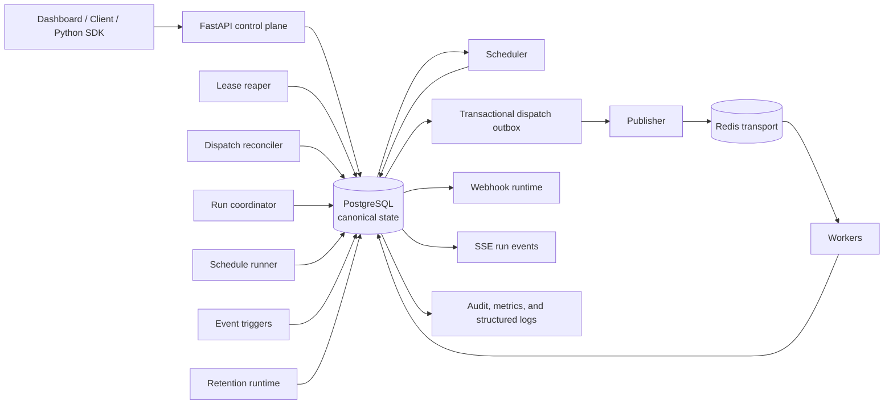

# Architecture

Fluxion separates canonical state from delivery transport. PostgreSQL stores
workflow definitions, immutable revisions, runs, task attempts, leases, outbox
rows, events, interventions, and operational records. Redis transports dispatch
messages only.

## Execution semantics

The scheduler creates a `DISPATCHED` attempt and matching outbox row in one
PostgreSQL transaction. The publisher later sends that durable intent to Redis.
This closes the database-to-broker gap but is at least once: publisher crash
windows and Redis delivery can produce duplicates.

Workers validate the dispatch against canonical state and claim the attempt with
a worker lease token. Terminal updates require the current lease, fencing stale
workers. The task idempotency key remains stable for the task-run identity;
attempt keys change for each attempt. PostgreSQL completion unlocks downstream
work for the scheduler.

## Recovery and ownership

The dispatch reconciler can make a stale, published-but-unclaimed dispatch
eligible for normal publication again without creating another attempt. The
lease reaper treats loss after worker ownership conservatively: it records an
`INTERRUPTED` attempt and durable operator intervention rather than retrying
ambiguous external side effects.

Run coordination is separate from worker ownership. Coordinator leases are
durable PostgreSQL records with fencing tokens; expiry permits safe takeover and
prevents stale coordinators from applying recovery mutations. An administrator
may resolve an interrupted attempt as RETRY, which creates a new attempt and
outbox intent, or FAIL, which creates neither.

## Other durable services

Schedules and event triggers create durable runs. Webhook delivery reads durable
run events and uses its own fenced delivery claims. Retention performs bounded,
oldest-first cleanup while protecting actionable outbox rows, active deliveries,
and pending interventions.

## Failure behavior

Scheduler or publisher loss leaves PostgreSQL state for later instances. A lost
Redis message is repaired only while it was never claimed; duplicate messages
are rejected safely by canonical claim/state checks. Worker loss before claim
leaves dispatchable work; loss after claim becomes an intervention. Coordinator
loss is recovered by lease expiry. PostgreSQL loss stops ready roles; Redis loss
stops dispatch-dependent roles and causes API readiness failure. API loss does
not alter durable execution state.

## Repository structure

| Path | Purpose |
| --- | --- |
| `app/api` | FastAPI control plane, routes, schemas, and API middleware |
| `app/core` | Settings, configuration, and shared core utilities |
| `app/db` | SQLAlchemy models, metadata, sessions, and database lifecycle |
| `app/dispatch` | Dispatch messages, Redis transport, and publishing behavior |
| `app/engine` | Workflow state, DAG execution, task execution, and recovery |
| `app/observability` | Structured logging and Prometheus-compatible metrics |
| `app/runtime` | Long-running role entrypoints and startup preflight |
| `app/sdk` | Public typed synchronous and asynchronous SDK |
| `app/security` | JWT authentication, RBAC, rate limiting, and security helpers |
| `app/services` | Repositories and operational/domain services |
| `app/tasks` | Worker task registry and built-in demo/benchmark task packs |
| `alembic` | Database migration history |
| `tests` | Unit, integration, chaos, and stress validation |
| `docs` | Deployment, architecture, release, and benchmark documentation |
| `scripts` | Local and CI validation helpers |
